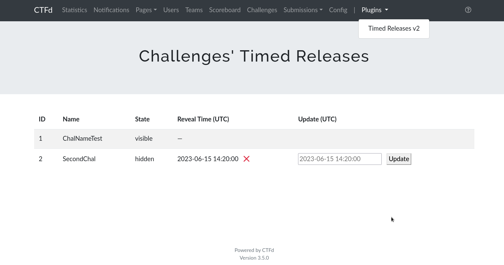

# Timed Releases v2

_modified fork of [ctfd-timed-releases-plugin](https://github.com/alokmenghrajani/ctfd-timed-releases-plugin) for newer version of CTFd_ 

CTFd plugin to add timed releases of challenges. 

This plugin has been tested with CTFd version 3.5.0 in default theme.

## Install

1. Clone this repository to your CTFd installation under `CTFd/plugins/`
2. Start/restart your CTFd instance

## About

* Participants do not see when the challenge will be revealed
* Implemented using new `TimedReleases` table in a db
* Specified release time is **always in UTC**